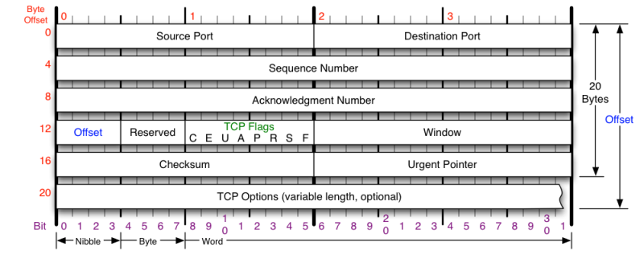
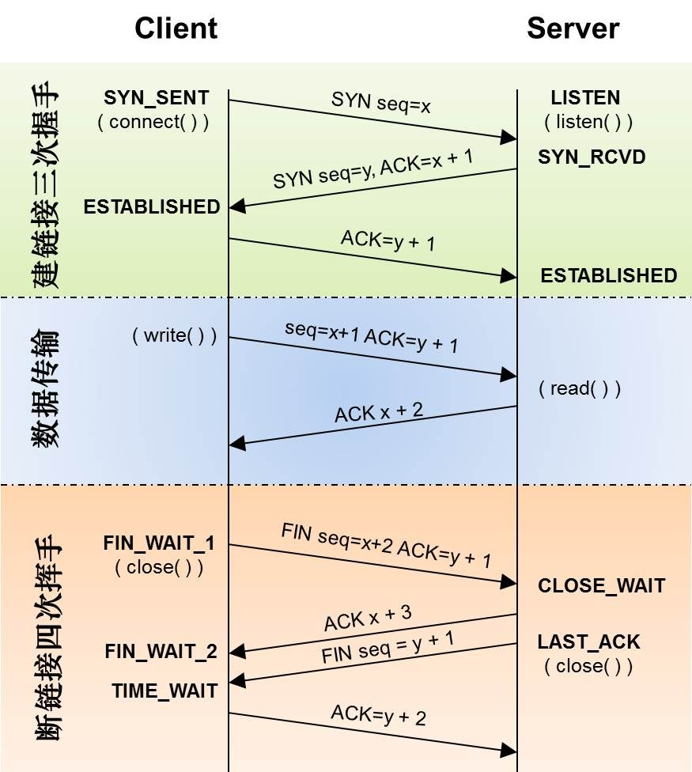
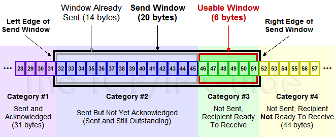
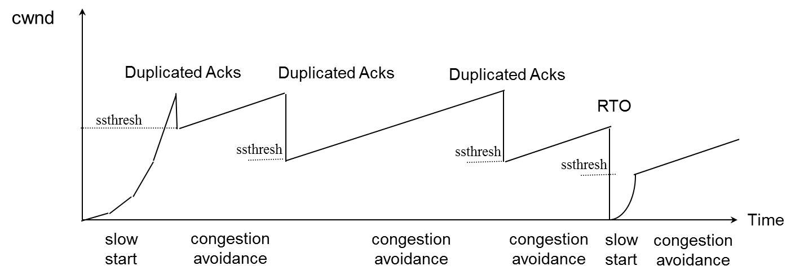

# TCP和拥塞控制

## 1. TCP基础

### 1.1 Header

 + Sequence Number 包的序号（Seq），增加数为包的长度
 + Acknowledgement Number 确认序号（Ack）
 + Window 窗口大小（接收缓冲区大小）
 + TCP Flag 包的类型

### 1.2 状态机

+ FLAGS:
    + SYN：同步序列编号（Synchronize Sequence Numbers）
    + ACK：确认序号有效
    + FIN：释放一个连接（Finish）

+ Entries & Parameters:
    + MSL: Maximum Segment Lifetime
    + SYN flood: SYN包攻击
    + tcp_tw_reuse: TIME_WAIT重用
    + tcp_tw_recycle: TIME_WAIT回收
    + tcp_max_tw_buckets: TIME_WAIT最大数量

### 1.3 TCP重传

#### 1.3.1 超时重传（Timeout Retransmit）

+ sender死等ACK，超时重传

#### 1.3.2 快速重传（Faster Retransmit）

+ receiver发送最后一个ACK
+ sender收到3个重复的ACK，则重传该包

#### 1.3.3 SACK（Selective Acknowledgment）

+ Header中增加SACK选项，记录接收端收到的数据包的SeqNum范围
+ Parameters: tcp_sack

#### 1.3.4 D-SACK（Duplicate Selective Acknowledgment）

+ SACK中记录重复的SeqNum范围（ACK范围大于于SACK范围）
+ Parameters: tcp_dsack

### 1.4 TCP的RTT（Round Trip Time）

#### 1.4.1 经典算法（RFC792）

+ Smoothed RTT:
    SRTT = (α * 历史SRTT) + ((1-α) * RTT)
+ Retransmission TimeOut:
    RTO = min [UBOUND, max [LBOUND, (β * SRTT)]]
+ α = [0.8, 0.9]
+ β = [1.3, 2.0]
+ UBOUND = 最大timeout时间
+ LBOUND = 最小timeout时间

#### 1.4.2 Karn / Partridge 算法

+ 忽略重传的RTT
+ 发生重传时，对RTO翻倍

#### 1.4.3 Jacobson / Karels 算法

+ SRTT = 历史SRTT + α*(RTT – 历史SRTT)
+ DevRTT = (1-β) * DevRTT + β * (|RTT-SRTT|)
+ RTO= µ * SRTT + ∂ *DevRTT
+ α = 0.125
+ β = 0.25
+ µ = 1
+ ∂ = 4

### 1.5 TCP滑动窗口

+ sender窗口（由receiver的ACK，窗口向右移动）
    + #1 已发送，已收到ACK
    + #2 已发送，未收到ACK
    + #3 未发送，有空间
    + #4 未发送，无空间
+ zero window
    + receiver缓冲区满，sender隔段时间发送ZWP（Zero Window Probe），让receiver发送ACK告知窗口大小
+ Silly Window Syndrome
    + 数据塞不满MTU（Maximum Transmission Unit），浪费带宽
    + 解决方案：
        + David D Clark算法：windowSize小于某值，receiver回复windowSize（由receiver引起的）
        + Nagle算法：sender将多个小包合并成一个大包发送（由sender引起的）

## 2. TCP拥塞控制

### 2.1 拥塞控制算法

#### 2.1.1 慢启动（Slow Start）

+ 初始cwnd（Congestion Window）=1
+ 每收到一个ACK，cwnd++（线性增长）
+ 每过一个RTT，cwnd=2*cwnd（指数增长）
+ cwnd>=ssthresh（slow start threshold，一般为65535 Byte）时，进入拥塞避免（Congestion Avoidance）

#### 2.1.2 拥塞避免（Congestion Avoidance）

+ 每收到一个ACK，cwnd=cwnd+1/cwnd
+ 每过一个RTT，cwnd++

#### 2.1.3 快速重传（Faster Retransmit）

+ 发生快速重传（收到3个duplicated ACK）时，cwnd/=2，ssthresh=cwnd
+ 进入快速恢复（Fast Recovery）

#### 2.1.4 快速恢复（Fast Recovery）

+ cwnd=ssthresh+3*MSS（Maximum Segment Size）
+ 重传丢失的包（根据Duplicate ACK）
+ 再收到一个Duplicated ACK，cwnd++
+ 收到新的ACK时，cwnd=ssthresh，进入拥塞避免

#### 2.1.5 TCP New Reno

+ 没有SACK时，发生快速重传，进入Fast Recovery
+ 在Fast Recovery阶段，根据部分 ACK（Partial Acknowledgment）机制，继续恢复丢失的包，直到所有丢失的包被确认，再进入拥塞避免

#### 2.1.6 FACK（Forward Acknowledgment）

+ SND.UNA：未被确认的最小序列号（发送窗口左端）
+ SND.NXT：下一个即将发送的序列号
+ FACK：SACK 选项中 最高确认序列号
+ 未确认数据量（inflight data）：
    inflight=SND.NXT−FACK
+ 丢包检测：
    当inflight突然下降时，sender认为FACK之前的包丢失，重传丢失的包
