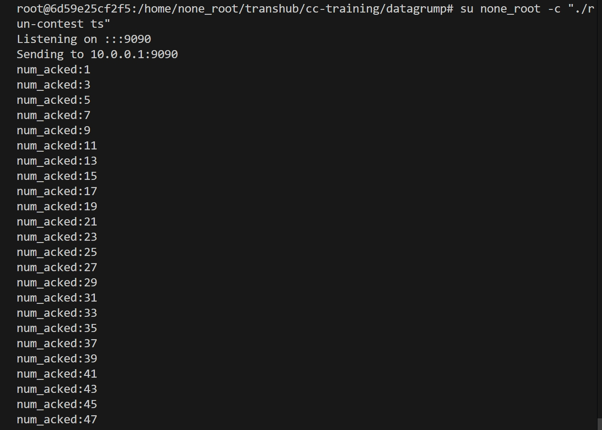

# Task 2 Lab Report

## 1. 任务目标

- 延迟ACK：为减少ACK开销，TCP采用延迟ACK机制，即每收到两个数据包才发送一个ACK

## 2. 实现思路

### 2.1 receiver.cc

在receiver.cc中加入seq_counter变量，用于记录收到的数据包数量,每当seq_counter为2时，发送一个ACK并重置seq_counter

```c++
      /* counter for the number of received datagrams for Delayed ACK */
    int seq_counter = 0;
```
```c++
    if(seq_counter == 2){
      /* send the ack */
      socket.sendto( recd.source_address, message.to_string() );
      /* reset the counter */
      seq_counter = 0;
    }
```

### 3. 测试结果



- 成功实现延迟ACK


