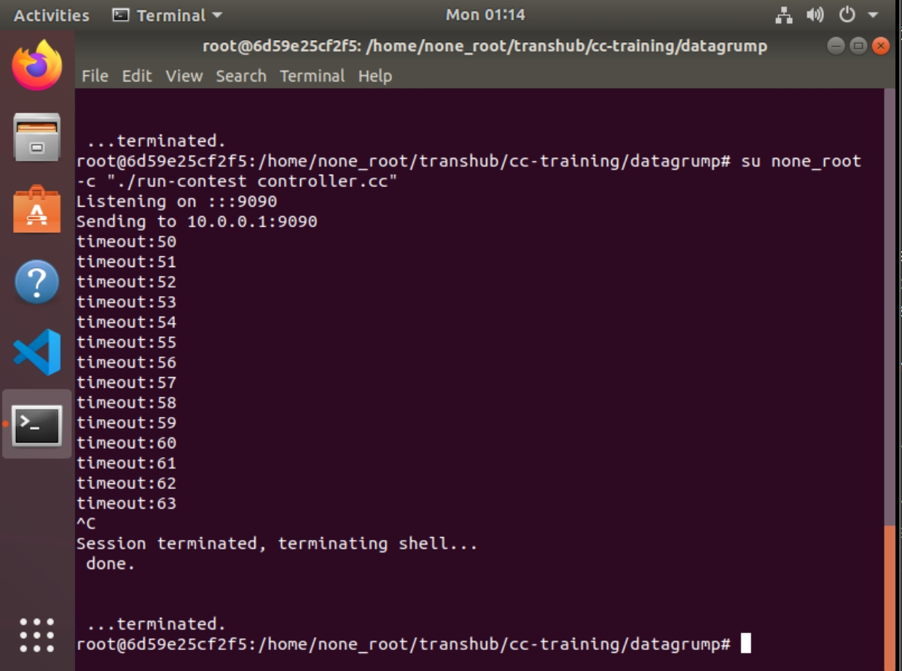
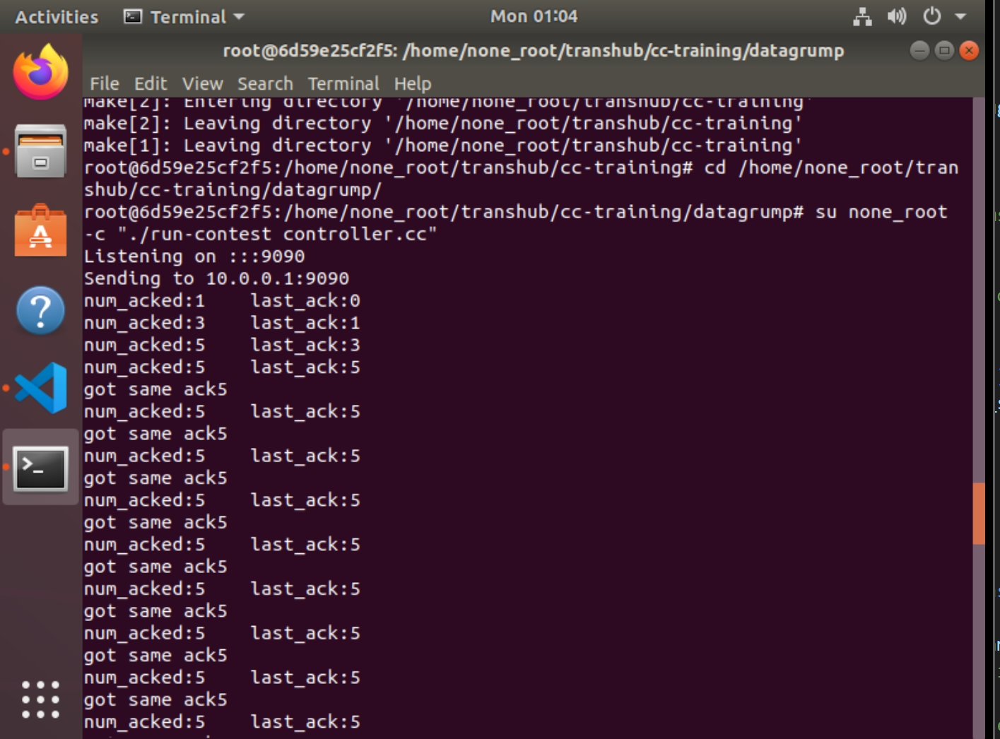

# Task 3 Lab Report

## 1. 超时处理

### 1.1. 实验目的

+ 在 controller.cc 中的 datagram_was_sent() 函数⾥实现检测是否发⽣了超时，如果发⽣了超时，打印“time out”信息并修改窗⼝⼤⼩。

### 1.2. 实验内容

+ 在 Controller 类中加入成员变量：
    + `uint64_t last_ack`：上次收到的 ack 的序号
    + `unsigned int the_window_size`：窗口大小
```cpp
    uint64_t last_ack = 0; // last ack num received
    unsigned int the_window_size = 50; // initial window size
```

+ 在 `datagram_was_sent()` 函数中，判断是否超时，并打印超时信息，修改窗口大小：
```cpp
    // Timeout
    if (after_timeout){
        cout << "timeout : " << sequence_number << endl;
        the_window_size = the_window_size / 2;
    }else {
        the_window_size = the_window_size + 1;
    }
```

### 1.3. 测试结果




## 2. 重复ACK处理

### 2.1. 实验目的

+ 阅读 receiver.cc 和 contest_message.cc 中的 transform_into_ack() 部分，在receiver.cc 中实现重复ACK，并在 controller.cc 中的 ack_received() 函数⾥实现对重复ACK的检测，如果发现了重复ACK就输出"got same ack"和该ACK确认的序列号。

### 2.2. 实验内容

+ 不修改 `contest_message.cc`，而是在 `receiver.cc` 中，
    + 用 `uint64_t last_ack_num` 记录上次收到的 ack 的序号，判断是否是有序到达的 ack
        + 如果有序到达，则更新 `last_ack_num` 为当前 ack 的序号
        + 如果无序到达，则修改当前 ack 的序号为 `last_ack_num`，并立即发送该 ack
    + 保持上次实验的连续 ack 机制，即收到两个连续的 ack 才发送一个 ack
```cpp
    uint64_t last_ack_num = 0;
    while ( true ) {
        // ...
        /* assemble the acknowledgment */
        if (message.header.sequence_number == last_ack_num + 1 || last_ack_num == 0){
            last_ack_num = message.header.sequence_number;
            message.transform_into_ack( sequence_number++, recd.timestamp );
        }else {
            message.header.sequence_number = last_ack_num;
            message.transform_into_ack( sequence_number++, recd.timestamp );
            // send the ack immediately
            if(seq_counter != 2){
            socket.sendto( recd.source_address, message.to_string() );
            }
        }
        // ...
        if(seq_counter == 2){
            /* send the ack */
            socket.sendto( recd.source_address, message.to_string() );
            /* reset the counter */
            seq_counter = 0;
        }
    }
```

+ 在 `controller.cc` 的 ack_received() 中，判断是否是重复的 ack，并打印重复 ack 的序号：
```cpp
    cout << "num_acked:" << sequence_number_acked
      << "    last_ack:" << last_ack << endl;

    // Repeated ACK
    if (sequence_number_acked == last_ack && last_ack != 0){
        cout << "got same ack" << sequence_number_acked << endl;
    }else {
        last_ack = sequence_number_acked;
    }
```

### 2.3. 测试结果




