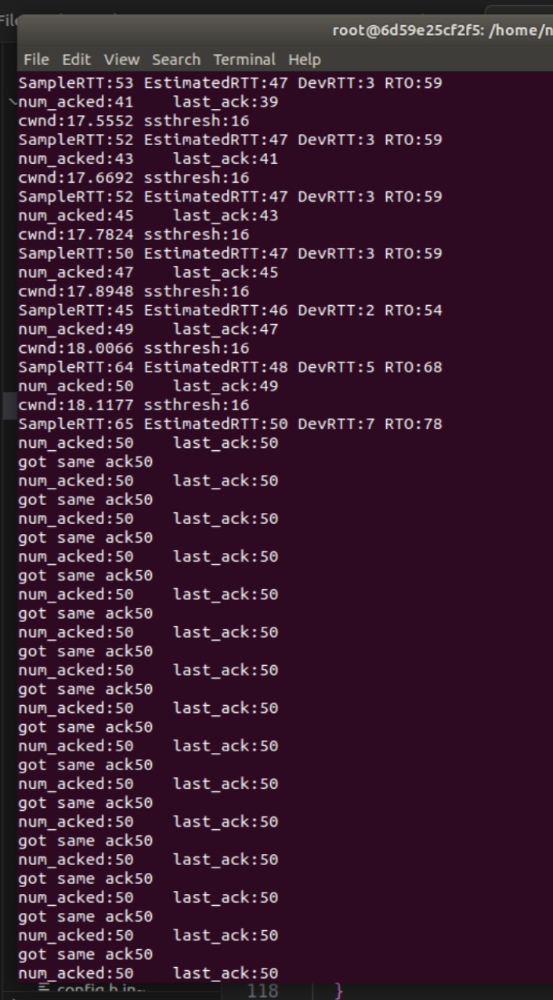

# Task 4 Lab Report

## 1. RTO 计算

### 1.1 实验目的

+ 计算RTO，用于动态调整超时重传时间

### 1.2 实验原理

+ EstimatedRTT = 0.875 * EstimatedRTT + 0.125 * SampleRTT （1）
+ DevRTT = 0.75 * DevRTT + 0.25 * |SampleRTT - EstimatedRTT| （2）
+ RTO = EstimatedRTT + 4 * DevRTT （3）
+ 其中，EstimatedRTT是估计的往返时间，SampleRTT是采样到的往返时间，DevRTT是往返时间的偏差

### 1.3 实验步骤

+ 在controller.cc的ack_received()中，
    + 第一次，初始化
    ```cpp
        // initial RTO
        SampleRTT = timestamp_ack_received - send_timestamp_acked;
        EstimatedRTT = SampleRTT;
        DevRTT = SampleRTT / 2;
        RTO = EstimatedRTT + 4 * DevRTT;
        cout << "SampleRTT:" << SampleRTT
            << " EstimatedRTT:" << EstimatedRTT
            << " DevRTT:" << DevRTT
            << " RTO:" << RTO << endl;
    ```
    + 当未遇到超时重传时，更新EstimatedRTT和DevRTT
    ```cpp
        // calculate RTO
        SampleRTT = timestamp_ack_received - send_timestamp_acked;
        EstimatedRTT = 0.875 * EstimatedRTT + 0.125 * SampleRTT;
        DevRTT = 0.75 * DevRTT + 0.25 * abs(static_cast<int64_t>(SampleRTT - EstimatedRTT));
        RTO = EstimatedRTT + 4 * DevRTT;
        cout << "SampleRTT:" << SampleRTT
            << " EstimatedRTT:" << EstimatedRTT
            << " DevRTT:" << DevRTT
            << " RTO:" << RTO << endl;
    ```

+ 在controller.cc的timeout_ms()中，返回RTO
```cpp
    unsigned int Controller::timeout_ms()
    {
    return RTO; /* timeout of one second */
    }
```

### 1.4 实验结果


## 2. AIMD 算法

### 2.1 实验目的

+ 实现AIMD算法，用于动态调整拥塞窗口大小

### 2.2 实验原理

+ 慢启动：当 cwnd < ssthresh 时，每收到一个 ACK，cwnd 加 1
+ 拥塞避免：当 cwnd >= ssthresh 时，每收到一个 ACK，cwnd 加 1/cwnd （即每轮acks，cwnd加1）
+ 当发生超时重传时，cwnd = cwnd / 2，ssthresh = cwnd / 2

### 2.3 实验步骤

+ 在class Controller中，定义cwnd和ssthresh
```cpp
    double the_window_size = 1; // window size
    unsigned int ssthresh = 16; // ssthresh
```

+ 在controller.cc的ack_received()中，(###考虑到接收端每收到两个数据包就会返回一个ack，所以cwnd的增加要乘以2###)
    + 当未遇到超时重传且 cwnd < ssthresh 时
    ```cpp
        if (the_window_size < ssthresh)
        {
        // slow start : increase by 1 every ack
        // receiver ack every two data
        the_window_size = the_window_size + 2;
        cout << "cwnd:" << the_window_size << " ssthresh:" << ssthresh << endl;
        }
    ```
    + 当未遇到超时重传且 cwnd >= ssthresh 时
    ```cpp
        else
        {
        // congestion avoidance : increase by 1 every round of acks
        // receiver ack every two data
        the_window_size = the_window_size + 2 / the_window_size;
        cout << "cwnd:" << the_window_size << " ssthresh:" << ssthresh << endl;
        }
    ```
    + 当发生超时重传时，
    ```cpp
          // Timeout
        if (after_timeout && sequence_number != 0 && sequence_number != 1)
        {
            cout << "timeout : " << sequence_number << endl;
            ssthresh = the_window_size / 2;
            the_window_size = 1;
            cout << "cwnd:" << the_window_size << " ssthresh:" << ssthresh << endl;
        }
    ```

### 2.4 实验结果

+ 慢启动阶段：cwnd每收到一个ACK加2
    
+ 拥塞避免阶段：cwnd每收到一个ACK加2/cwnd
    
+ 超时重传阶段：cwnd减半，ssthresh减半
    连续两次超时，ssthresh减为0
    


